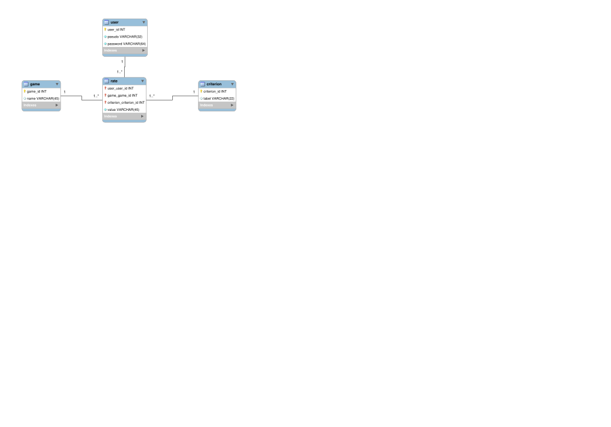

# SQL : Application au projet de plateforme de recommandation de jeux

Application des notions vues en cours sur une version minimale d'un projet de plateforme de recommandation de jeux. Sur cette plateforme, les utilisateur·ices notent les jeux selon différents critères (gameplay, graphisme, design sonore, etc.). La plateforme utilise ces données pour bâtir un système de recommandations pour chaque utilisateur·ice.

## Prérequis

- MySQL Community Edition
  
## Utiliser

### En *batch mod*

Fournir les scripts au client `mysql` :

1. Créer la base et le schéma :

~~~bash
mysql -uuser -p < schema.sql
~~~

avec `user` votre utilisateur MySQL.

2. Insérer le jeu de données test

~~~bash
mysql -uuser -p < data.sql
~~~

On peut exécuter ces deux instructions en une seule commande :

~~~bash
mysql -uuser -p < schema.sql && mysql -uuser -p < data.sql
~~~

### Depuis une connexion ouverte

1. Ouvrir une connexion avec `mysql`. Une fois connecté, chargez les scripts :
2. Utiliser l'instruction SQL `SOURCE`

~~~bash
mysql> SOURCE schema.sql;
mysql> SOURCE data.sql;
# Regénérer le schéma et l'état de la base avec le jeu de données test en une commande
mysql> SOURCE schma.sql; SOURCE data.sql;
~~~

## Conception

La conception a été réalisée avec [MySQL Workbench](https://www.mysql.com/products/workbench/). Charger le fichier `projet-game-rating-platform.mwb` avec le logiciel.

### Modèle Conceptuel des Données (MCD)

## Remarques

Lorsque vous développez, faites en sorte d'avoir *une boucle de développement (modification, test) rapide*. Prenez le temps de préparer votre environnement pour avoir une boucle aussi courte que possible (moins d'actions possible à faire de votre part). Cela vous encouragera à tester vos idées tout en allégeant la charge mentale et vous permettra de vous concentrer sur ce qui compte vraiment, votre travail de conception et d'implémentation. Ici, avec *une* commande on recrée le schéma et réinitialise la base dans un état donné.

